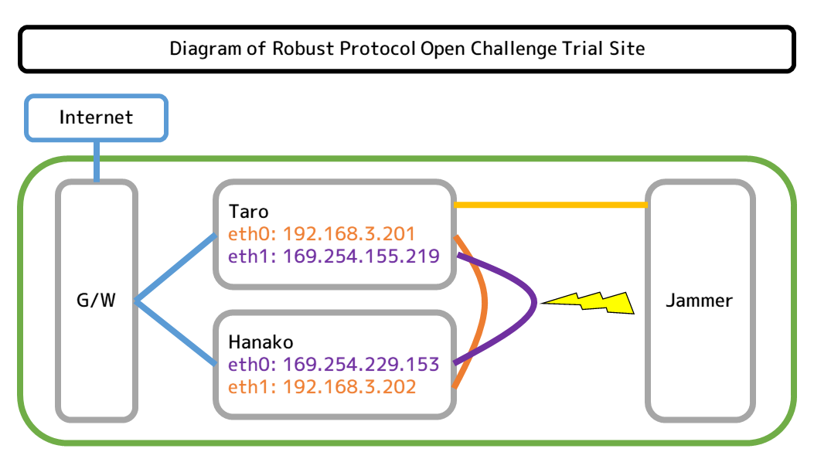

# Robust Protocol Open Challenge

In general, cyber security tends to focus on protecting information devices and data from malicious attackers.  
In addition to this, securing communication from accidents and natural disasters is also an important task of information security.  
We have designed a contest to compete for skills to accomplish such tasks.  

Robust Protocol Open Challenge is challenge to design and implement protocol that can transfer files between two nodes that are connected by a faulty LAN cable, and compete with its performance.

 

The Jamming Machine is used to cause a pseudo failure in LAN cable (10BASE-T).  
It jams communication by injecting electrical noise into the cables.  
The noise pattern and timing are programmable, and currently it is adjusted to about 50% packet loss according to result of `ping` command.

```plaintext
$ ping -c 10 hanako
PING hanako (169.254.229.153) 56(84) bytes of data.
64 bytes from hanako (169.254.229.153): icmp_seq=1 ttl=64 time=0.842 ms
64 bytes from hanako (169.254.229.153): icmp_seq=3 ttl=64 time=0.733 ms
64 bytes from hanako (169.254.229.153): icmp_seq=5 ttl=64 time=0.695 ms
64 bytes from hanako (169.254.229.153): icmp_seq=9 ttl=64 time=0.717 ms
64 bytes from hanako (169.254.229.153): icmp_seq=10 ttl=64 time=0.716 ms

--- hanako ping statistics ---
10 packets transmitted, 5 received, 50% packet loss, time 274ms
rtt min/avg/max/mdev = 0.695/0.740/0.842/0.060 ms
```

## Robust Protocol Open Challenge Trial Site

We have prepared a remote server (Trial Site) where you can test your protocol.  
Nodes are constructed by two Raspberry Pi-2, and each node has host name of "Taro" and "Hanako".  
You can participate the contest by logging in to these two hosts using provided access information.  
Currently, following languages can be used to implement the protocol.  

- gcc version 8.3.0(Raspbian 8.3.0-6+rpi1)  
- go version go1.15.3 linux/arm  
- Python 2.7.16  
- Python 3.7.3  
- Rust  
- NodeJS v14.15.4 (npm v6.14.10)

### Diagram of Trial Site



### Photo of Trial Site


## Regulation

- Bidirectional transfer testing (NodeA->NodeB & NodeA<-NodeB)
- The programs for sending and receiving can be different programs.
- For bidirectional transfer, they must be the same program.
- File transfer must pass through a jamming machine
- Do not tune the machine
- Only programs that run in user mode are allowed
- File compression is prohibited.
- File transfer time limit is 60 seconds.
- Use scripts prepared by the administration to generate files for transfer.
- Verification of the received file must be done by the script prepared by the organizer.

## Scoring Criteria

After the time limit of 60 seconds, we will check the files that have been saved inside the receiving side by running `cmp.py`. Following are the criteria to calculate score.
  
- \+ 10pts per correct file  
- \- 10pts per file containing errors  
- \- 5pts per duplicate file (files with equal content)  

## Robust Protocol Open Challenge Contest Flow

1. Run `ready.sh` to generate files to transfer in Taro
2. Send generated files from Taro to Hanako (within 60 seconds)
3. Run `cmp.py` on Hanako to check error free transferred files
4. Run `ready.sh` to generate transfer files on Hanako
5. Send generated files from Hanako to Taro (within 60 seconds)
6. Run `cmp.py` on Taro to check error free transferred files

## Getting Started

1. Run `git clone https://github.com/imaoca/robust.git` (on both hosts, Taro and Hanako)
2. Run `cd robust` (on both hosts, Taro and Hanako)
3. Edit HOST , USER , DIR variables on ready.sh (on Taro) as following:
  - `HOST` : `192.168.3.202` (IP Address of Hanako)
  - `USER` : User name of your group account (eg. `group1`)
  - `DIR` : `~/robust/`
4. Run `sh ./ready.sh` (on Taro)
  - You can ignore No such file or directory error here.
  - Files to transfer from Taro to Hanako will be generated at `data/` directory
  - `check.md5` , the hash list of generated file will be transferred to Hanako
5. Write sender program and receiver program that uses robust protocol designed by your group
  - Your robust protocol should not rely on protocol such as TCP
  - Received files should be placed at data/ directory
  - You can use sample program (files under `sample` directory) as reference
6. Execute sender program with `timeout 60` on Taro, and receiver program on Hanako.
  - There is time limit of 60 seconds to send files
7. Run `python3 cmp.py` to check if files received are correct (on Hanako)
  - `cmp.py` should be placed in same directory with `check.md5` 
  - We will be evaluating your groups' protocol using output of this script.
  - Sample Output: `OK = 271, FAILED = 729, DUP = 0` 
8. Reverse Taro and Hanako in instructions above to test if your program also works for `Hanako -> Taro`

## GCC 2022 Taiwan  

### Trainer

Michihiro Imaoka (Hiro) JP  
@imaoca  
imaoca@gmail.com  
https://www.facebook.com/imaoka.micihihiro/

### Tutors

- Naoki Takayama  
- Kazuki Matsuo  
- Lena Yu

### Time Table

Whole lecture will be time for group presentation to explain protocol/program developed in your group, so you must contact your groupmates and start working on this challenge as soon as possible. If you have any questions about this challenge, read [Frequently Asked Questions](./faq.md) first, and ask trainer/tutors through Slack if there were no answer on it.

**[4hour = 240min]** 

- [10min] Opening
- [60min] Preparation of program and presentation
- [10min] Break
- [25min per team] For the 5 teams
  - [4min] Operator preparation
  - [6min] Start of competition
  - [10min] Presentation of algorithm (ranking update behind the scenes & operator cleans up)
  - [5min] Feedback and discussion
- [5min] Break
- [15min] Feedback and discussion for all teams
- [10min] Result announcement & awards ceremony

### Trial Site SSH Accounts

The Trial Site is currently available to GCC 2022 Taiwan students.  
If you want to try it, please send your SSH public key and group number to `@Naoki Takayama [JP.22tw.Sf]` via Slack.   
After creating an account on Trial Site, we will send you access information to it.  
