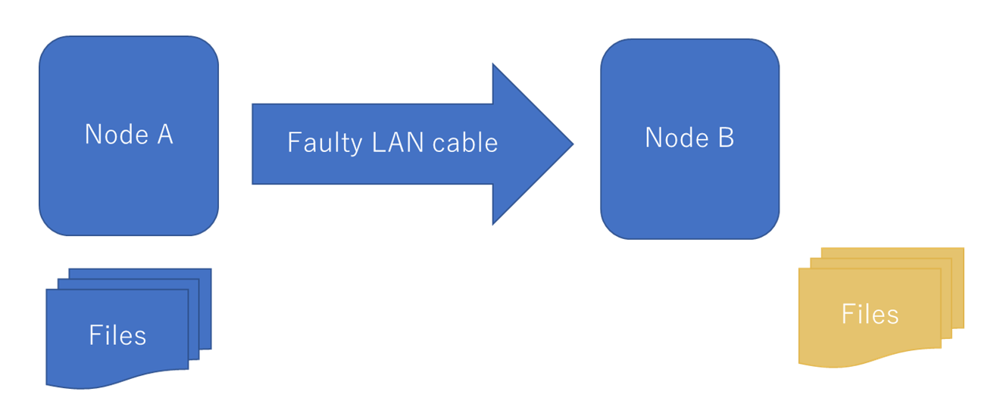
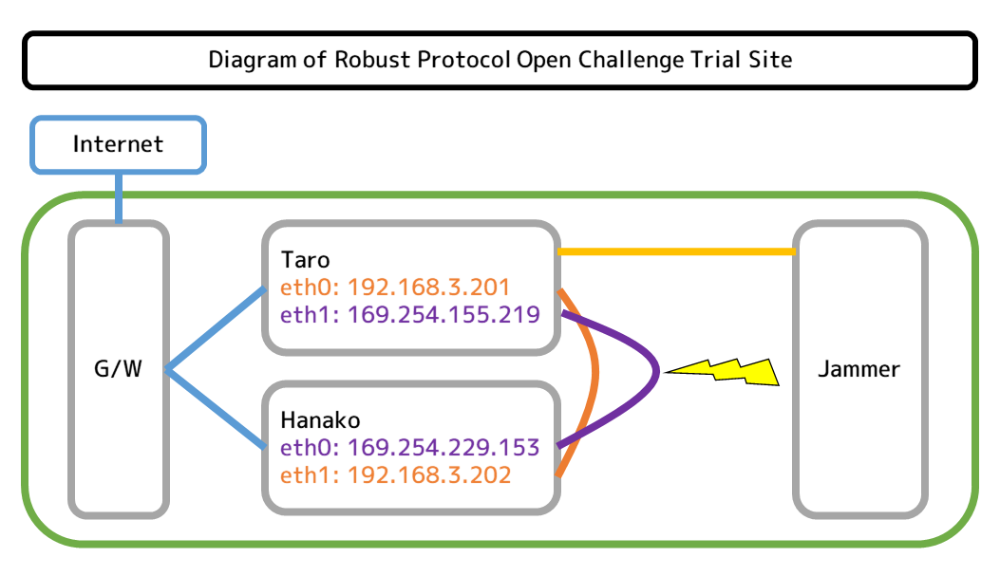
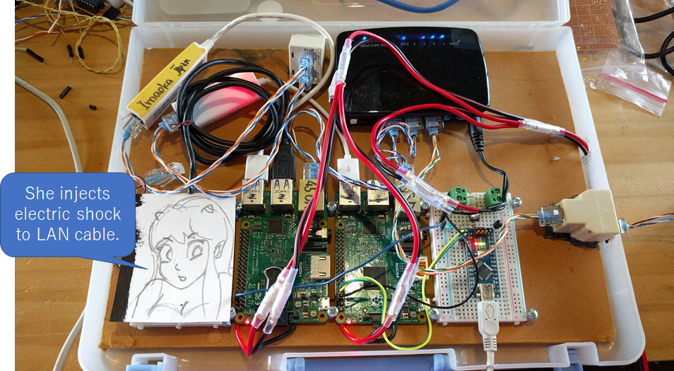

# Robust Protocol Challenger’s Guide

## GCC 2021 Online

### Trainer

Michihiro Imaoka (Hiro) JP  
@imaoca  
imaoca@gmail.com  
https://www.facebook.com/imaoka.micihihiro/

### TAs

Yuya Tsuru  
Naoki Takayama

---

# Background

In general, cyber security tends to focus on protecting information devices and data from malicious attackers.  
In addition to this, securing communication from accidents and natural disasters is also an important task of cyber security.  
We have designed a contest to compete for skills to accomplish such tasks.  

---

# What is Robust Protocol Open Challenge

Node A and Node B are connected by a faulty LAN cable.  
Transfer files from node A to B or node B to A.  
Compete for the number of error-free file transfers.  

 

----

# Robust Protocol Open Challenge Trial Site

We have prepared a remote server that causes a pseudo failure on LAN.   
Nodes are constructed by two Raspberry Pi-2.  
You can participate in the contest by logging in with SSH etc.  
The following languages ​​are usable to implement the protocol.  

- gcc version 8.3.0(Raspbian 8.3.0-6+rpi1)  
- go version go1.15.3 linux/arm  
- Python 2.7.16  
- Python 3.7.3  
- Rust  

---

# Diagram of Trial Site

 
Hanako's eth0 IP address can change.
Now it's 192.168.3.9.
----

# Photo of Robust Protocol Challenge Trial Site



----

# Scoring Method

After the time limit, we are checking the files that has been saved inside the receiving side. Scoring will be done as follows.  
  
\+ 10pts per correct file  
  
\- 10pts per file containing errors  
  
\- 5pts per duplicate file (files with equal content)  

----

# Trial Site SSH Accounts

The trial site is currently available.  
If you want to try it, please send us your SSH public key.  
After creating an account, we will send you your login information. Please contact below.  
  
@Yuya Tsuru [JP.21on.Tu] 
  
Currently, trial site login rights are only granted to "GCC 2021 Online" participants.

---

# Preparation

1. Create a directory for each group in `/home/pi`.
2. Copy files (show on next page) from [this GitHub repository](https://github.com/imaoca/robust).
3. Create a `data` directory in that directory.
4. Perform the above operations on the soruce node and destination node.

---

# Files

~~~
pi@Taro:~/demo $ ls
ready.sh  	// Shell script to generate files for the competition. (1000 files) 
check.md5	// It will be created by "ready.sh". This file will be transferred to receiving side, and be used for hash check of transferred files.
data  		//Directory for transferred files. Create this directory before executing the "ready.sh". At the destination side, before receiving, files of the directory have to be cleaned.
cmp.py		// Python script for hash check after the competition.
main.py 	// Sample Transfer Program
README_user0.md  	// Guide for the sample program. Rewrite the file name so that you can see the user name.
general.py  // Following files are the modules used in  python script. 
scu.py  
utils.py
packet.py 
__pycache__ // Cache directory for Python. No need to copy from the repository.
jammer.py   // Jamming script
~~~

---

# What is a LAN cable with failure

By using Jamming Machine, LAN cable(10BASE-T) causes a pseudo failure.  
The Jamming Machine is located between LAN cables and interferes with communication by injecting electrical noise into the cables.  
The noise pattern and timing are programmable and this time adjusted to about 50% packet loss with Ping examine.  

---

# Jamming Machine (jammer.bash)

The Jamming Machine that fails the LAN cable is executed by the following script. You need root privileges to run this script.

~~~bash
#!/bin/bash
trap 'echo "wait a moment..."; echo 17 > /sys/class/gpio/unexport; sleep 5; echo "cleaned gpio17."; exit 0;' 2
echo 17 > /sys/class/gpio/unexport
echo 17 > /sys/class/gpio/export
echo out > /sys/class/gpio/gpio17/direction
while true
do
  sleepenh `printf 0.0%03d $((150 + $RANDOM % 100))`
  echo 1 > /sys/class/gpio/gpio17/value
  sleepenh `printf 0.0%03d $((150 + $RANDOM % 100))`
  echo 0 > /sys/class/gpio/gpio17/value
done
~~~

---

# Setup Ethernet Adapters

Both LAN adapters(eth\*) for the faulty cable should be configured speed 10 and duplex "half". You need root privileges to run this script.

### At Taro

~~~bash
sudo ethtool -s eth1 autoneg on
sudo ethtool -s eth1 autoneg off
sudo ethtool -s eth1 duplex half
sudo ethtool -s eth1 speed 10
~~~

### At Hanako

~~~bash
sudo ethtool -s eth0 autoneg on
sudo ethtool -s eth0 autoneg off
sudo ethtool -s eth0 duplex half
sudo ethtool -s eth0 speed 10
~~~

---

# Robust Protocol Open Challenge Contest Flow

1. Generate files to transfer in Taro
2. Send generated files from Taro to Hanako
3. Evaluations on Hanako (Check error free transferred files)
4. Generate transfer files on Hanako
5. Send generated files from Hanako to Taro
6. Evaluations on Hanako (Check error free transferred files)

---

# 1. Generate files to transfer in Taro (ready.sh)


~~~bash
#!/bin/sh
rm data/*
rm check.md5
for i in `seq 0 999`
do
    cat /dev/urandom | head -c 102400 > data/data$i
done
cd data
md5sum $(find . -type f) | tee ../check.md5
cd ..

HOST=192.168.3.9
USER=pi
DIR=demo/
scp check.md5 ${USER}@${HOST}:${DIR}
~~~    

Enter the values in `ready.sh` ​​for the following variables according to the environment.  
(Variables: `HOST`, `USER`, `DIR`)

---

# 2. Send generated files from Taro to Hanako

```
# Taro->Hanako

Taro: python3 main.py sender
Hanako: python3 main.py receiver

# Hanako-> Taro

Taro: python3 main.py receiver
Hanako: python3 main.py sender

(From README_user0.md)
```

---

# 3. Evaluations on Hanako (Check error free transferred files)

Run following command on destination node.

~~~
$ python3 cmp.py
~~~

---

# 4. Generate files to transfer in Hanako

# 5. Send generated files from Hanako to Taro

# 6. Evaluations on Hanako (Check error free transferred files)

These procedures will be done by switching the sender and receiver.

---

# Sample Program to Transfer the Files

~~~py
import sys
# import threading
import utils
from scu import SCU

def main():
    if sys.argv[1] == "sender":
        scu = SCU(mtu=1500)
        scu.bind_as_sender(receiver_address=("169.254.229.153", 8888))
        try:
            for id in range(0, 1000):
                scu.send(f"./data/data{id}", id)
                print(f"file sent: {id}", end="\r")
        except Exception as e:
            print(e)
            scu.drop()

    elif sys.argv[1] == "receiver":
        # TODO
        scu = SCU(mtu = 1500)
        scu.bind_as_receiver(receiver_address = ("169.254.155.219", 8888))
        for i in range(0, 1000):
            filedata = scu.recv()
            utils.write_file(f"./data/data{i}", filedata)
            print(f"file received: {i}", end="\r")

if __name__ == '__main__':
    main()
~~~

---

# Time Limit

File transfer is done within the time limit of 60 seconds. An execution example is shown below.

~~~
$ timeout 60 python3 sender
~~~

---


# Trial Site Schedule Management

You can try the programs developed by each group on the trial site.  
However, if multiple programs uses a failed LAN, the original performance will not be resulted.  
If you want to use the trial site independently, you need to make a reservation, so please check it out.  

[Page to make a Reservation](https://calendly.com/robust_gcc2021)  

In the case, please check the free time on the trial site before using it.  

---

# Come on challengers!
